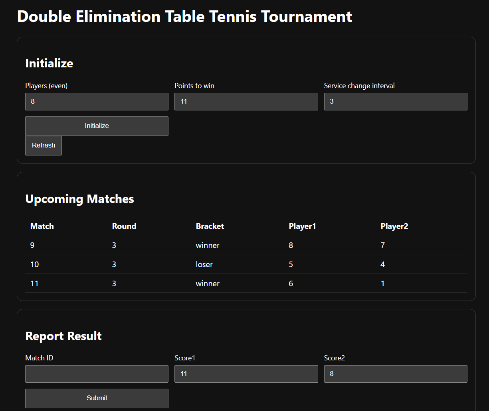
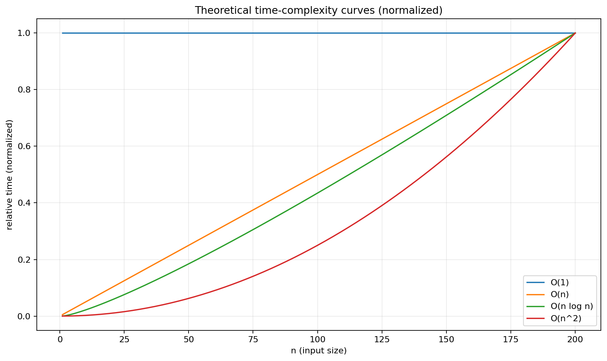
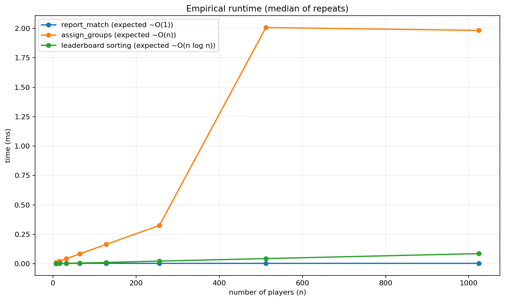

# IS-211 Mandatory Assignment Report (Spring 2026)
## Double-Elimination Table Tennis Club Counter & Tournament Planner (Prototype)

**Course:** IS-211 (Information Systems Department)  
**Term:** Spring 2026  
**Group members (2-4):** Laura Kalzhan, Ulviyya Taghi-zada
**Prototype link:** https://github.com/heghiw/tttt

### Contents
1. Business Idea Description  
2. Application Features  
3. Analyze the Python Code (Algorithms + Complexity)  
4. Data Structures (Selection + Rationale)  
Appendix A - How to Run   
Appendix B - AI Tools Used 

---

## 1) Business Idea Description

### 1.1 Context and motivation
This project originates from an organizational problem in an unofficial UIA table-tennis club. When the club started, only four people regularly attended, so it was easy to keep track of who played whom and what the score was using informal notes or memory.

As participation grew, the same approach stopped working. On busy days, up to ~20 people can attend, and organizers need to coordinate pairings quickly, avoid obvious repeats, and record match results consistently. Without a clear system, time is spent on administration instead of playing, and mistakes (missing results, inconsistent scores, unclear eligibility) become common.

This motivated a dedicated application focused on two core needs: (1) a single, reliable source of truth for the current tournament state, and (2) simple, structured workflows for planning matches and reporting scores.

### 1.2 Problem statement
When participation grows beyond a small group, running a club session becomes a workflow problem, not just a social activity. The organizer must execute the event (create matches and keep people playing) while preserving information integrity (results and eligibility must be correct):

- **Counting/registration:** maintaining a consistent set of player records (who is in the tournament).
- **Scheduling/pairing:** selecting eligible players and producing upcoming matches.
- **Result validation:** preventing invalid scores and inconsistent win conditions.
- **State management:** ensuring wins/losses, elimination status, and leaderboards remain consistent across the entire event.

Manual processes (paper notes, chat messages, ad-hoc spreadsheets) fail in predictable ways:

- State inconsistencies (different sources disagree about a player's losses).
- Invalid inputs (scores recorded that do not satisfy the win condition).
- Low transparency (participants cannot verify that rules were applied uniformly).
- Slow iteration (pairing the next round becomes a bottleneck, increasing idle time).

### 1.3 Target users / customers
- **Organizers (primary users):** minimize administrative workload, prevent mistakes, and run events on time.
- **Players (secondary users):** verify eligibility (active vs eliminated), view pairings, and understand standings.

### 1.4 How software supports the club (solution overview)
The business idea is a lightweight "counter and coordinator" application for informal club tournaments. Instead of tracking everything manually, the organizer uses a small web application that:

- Maintains tournament state in one place (players, matches, rounds).
- Generates upcoming matches (pairings) for the currently active players.
- Records results in a structured way and updates standings immediately.

### 1.5 Tournament format used in this prototype
To ensure the system does more than "store numbers", we implemented a concrete and widely used rule set: **double elimination** for singles matches. This makes the state transitions explicit and reduces disputes, because the application can clearly explain why a player is still eligible (0 or 1 loss) or why they are eliminated (2 losses).

In the double-elimination rules used by the prototype:

- A player is eliminated only after accumulating **two losses**.
- After the first loss, the player remains eligible for future matches.
- After the second loss, the player is marked as **eliminated** and excluded from future rounds.
- When exactly two active players remain, the system schedules a final match (`bracket = "final"`).

### 1.6 Scope and assumptions
- Players are represented by numeric IDs; `name` is optional.
- Pairing is random among active players (not a strict bracket tree).
- State is stored in memory (no persistence). This is sufficient for demonstrating algorithms, data structures, and complexity.

---

## 2) Application Features

### 2.1 Architecture overview
The prototype is implemented as a modular FastAPI application with a clear separation of concerns:

- **API layer (`backend/main.py`):** HTTP endpoints, request validation, and response formatting.
- **Models (`backend/models.py`):** Pydantic classes defining the structure of `Player`, `Match`, and `TournamentConfig`.
- **Core logic + state (`backend/storage.py`):** `TournamentState` which implements setup, pairing, result reporting, and leaderboards using in-memory data structures.
- **UI (`backend/templates/index.html`, `backend/static/app.js`, `backend/static/styles.css`):**  browser interface communicating with the backend via REST.

### 2.2 Architectural style and data flow
From an information-systems perspective, the application follows a simple three-layer structure:

1. **Presentation layer (browser UI):** collects organizer inputs (player count, scores) and displays outputs (matches, standings).
2. **Application layer (REST API):** validates inputs, translates them into state operations, and returns results as JSON or plain text.
3. **Domain layer (tournament state):** implements the rules and maintains the authoritative state representation.

The key design decision is that the UI does not contain business logic. Instead, the UI sends requests to the API, and the API delegates to `TournamentState`.

**Typical data flow (round cycle):**

1. Organizer submits setup parameters in the UI.
2. The UI sends `POST /tournament/setup` with JSON configuration.
3. The backend constructs players and returns an initialized list.
4. Organizer clicks "Refresh" to request match groups.
5. The UI sends `GET /tournament/groups` and renders the returned matches in a table.
6. After a real-world game completes, the organizer submits the match ID and scores.
7. The UI sends `POST /tournament/match?match_id=...&score1=...&score2=...`.
8. The backend validates and updates state; leaderboards can be retrieved at any time.

This cycle matches the operational workflow of a small club tournament: short rounds of play followed by quick reporting and generation of the next set of matches.

### 2.2 Feature list 

#### Feature A: Tournament setup (count players + configure rules)
**Purpose:** initialize the tournament and create player records (the "counter" component).

- API: `POST /tournament/setup` in `backend/main.py`
- Logic: `TournamentState.setup(...)` in `backend/storage.py`
- Classes: `TournamentConfig`, `Player` in `backend/models.py`

**Code example (API endpoint):**
```python
# backend/main.py
@app.post("/tournament/setup")
def setup(config: TournamentConfig):
    if config.player_count < 2 or config.player_count % 2 != 0:
        raise HTTPException(status_code=400, detail="Player count must be even and at least 2")
    state.setup(config.serves_per_match, config.player_count, getattr(config, "service_change_interval", 3))
    return {"message": "Tournament configured", "players": [p.dict() for p in state.players]}
```

#### Feature B: Round pairing / match generation ("groups")
**Purpose:** generate the next set of matches from currently active (non-eliminated) players.

- API: `GET /tournament/groups` in `backend/main.py`
- Logic: `TournamentState.assign_groups()` in `backend/storage.py`
- Class: `Match` in `backend/models.py`

**Code example (pairing core):**
```python
# backend/storage.py
active_players = [p for p in self.players if not p.eliminated]
shuffled = active_players.copy()
random.shuffle(shuffled)

self.current_round += 1
round_num = self.current_round

for i in range(0, len(shuffled), 2):
    chunk = shuffled[i : i + 2]
    if len(chunk) < 2:
        break
    p1, p2 = chunk
    bracket = "winner" if (p1.losses == 0 and p2.losses == 0) else "loser"
    match = Match(id=self.next_match_id, player1=p1, player2=p2, serves=self.config.serves_per_match, round=round_num, bracket=bracket)
    self.matches[self.next_match_id] = match
    self.next_match_id += 1
    groups.append(match)
```

#### Feature C: Match result reporting (validated state transition)
**Purpose:** record a result, validate it, and update tournament state (wins/losses/elimination).

- API: `POST /tournament/match` in `backend/main.py`
- Logic: `TournamentState.report_match(...)` in `backend/storage.py`

**Code example (validation + elimination):**
```python
# backend/storage.py
min_points = self.config.serves_per_match
if not ((score1 >= min_points or score2 >= min_points) and abs(score1 - score2) >= 2):
    raise ValueError("Score does not satisfy serves/minimum+2 rule")

winner = match.player1 if score1 > score2 else match.player2
loser = match.player2 if score1 > score2 else match.player1
winner.wins += 1
loser.losses += 1
if loser.losses >= 2:
    loser.eliminated = True
```

#### Feature D: Leaderboards (status reporting)
**Purpose:** provide transparent summaries of tournament progress.

- Losers leaderboard (eliminated players): `GET /tournament/leaderboard` and `GET /tournament/leaderboard/losers`
- Winners list (active players): `GET /tournament/leaderboard/winners`
- Readable output: `GET /tournament/leaderboard/readable`

### 2.3 UI picture (provided screenshot)
The prototype includes a minimal UI to make the workflow observable for organizers.



**UI-functional mapping (what each section triggers):**
- Initialize card = calls `POST /tournament/setup` and resets state.
- Upcoming Matches card = renders output of `GET /tournament/groups` (match ID, round, bracket, player IDs).
- Report Result card = calls `POST /tournament/match` and updates the state; leaderboards update implicitly because they are computed from state.

---

## 3) Analyze the Python Code (Algorithms + Complexity)

### 3.1 Complexity graphs
Two graphs are included to support the complexity analysis:

- **Theoretical curves:** canonical shapes of common complexity classes.
- **Empirical benchmark:** median runtime for selected functions as the number of players increases.





These graphs were generated by running `report_assets/generate_complexity_graphs.py`.

### 3.2 Algorithm 1: Setup (initialize players and reset state)
**Goal:** create `n` players and reset all in-memory structures.

**Pseudocode:**
```text
SETUP(serves_per_match, player_count):
  config <- (serves_per_match, player_count, service_interval)
  players <- empty list
  for i from 1 to player_count:
    players.append(Player(id=i))
  matches <- empty dictionary
  rounds <- empty dictionary
  next_match_id <- 1
  current_round <- 0
```

**How it works:** player records are constructed sequentially, and all state from any previous run is cleared.

**Time complexity:** `O(n)` for creating `n` players.  
**Space complexity:** `O(n)` to store player records.

### 3.3 Algorithm 2: Pairing / group assignment (generate next round)
**Goal:** schedule matches among active players.

**Pseudocode:**
```text
ASSIGN_GROUPS():
  if config is missing: error
  active <- [p in players where p.eliminated == false]
  if size(active) < 2: error
  if size(active) == 2:
    create one FINAL match and return
  shuffle(active)
  current_round <- current_round + 1
  for i from 0 to size(active)-1 step 2:
    if i+1 out of range: break
    p1 <- active[i]; p2 <- active[i+1]
    bracket <- "winner" if p1.losses==0 and p2.losses==0 else "loser"
    create match with new id, round=current_round, bracket=bracket
    store match in matches and in rounds[current_round]
  return list of created matches
```

**How it works:** eliminated players are filtered out, remaining players are shuffled, and adjacent pairs are scheduled.

**Time complexity:** `O(n)` to filter players + `O(a)` shuffle + `O(a)` pairing loop, where `a` is the number of active players. Overall `O(n)`.  
**Space complexity:** `O(a)` for the shuffled list and new matches in the round.

#### 3.3.1 Handling odd number of active players
Although the prototype requires an even `player_count` at setup time, the number of *active* players can become odd as the tournament progresses. For example, if one match result eliminates a player early, the next round may have `a = 5` active players. In this case the prototype:

- Shuffles the active list, and
- Creates matches in pairs until a single player remains without an opponent.

That remaining player is effectively given a **bye** for the round: they are not scheduled, and they remain active for the next round. This is a common practical approach in community tournaments where strict bracket constraints are not enforced.

This design preserves correctness (no invalid match with one player is created), and it keeps the algorithm simple. 

#### 3.3.2 Bracket label assignment
The `bracket` label in this prototype is a heuristic designed to improve interpretability:

- `"winner"` when both players have `losses == 0`
- `"loser"` when at least one player has `losses > 0`
- `"final"` when exactly two active players remain

**Pseudocode:**
```text
BRACKET_LABEL(p1, p2, active_count):
  if active_count == 2: return "final"
  if p1.losses == 0 and p2.losses == 0: return "winner"
  return "loser"
```

This labeling does not enforce a strict winners/losers bracket tree, but it supports communication: organizers can quickly see whether the system is pairing undefeated players together or whether a match involves players who already have a loss.

### 3.4 Algorithm 3: Report match result 

**Goal:** ensure the result is valid and update player stats consistently.

**Pseudocode:**
```text
REPORT_MATCH(match_id, score1, score2):
  match <- matches[match_id]  (dictionary lookup)
  if match missing: error
  validate (score1, score2) satisfies minimum points and win-by-2
  determine winner and loser
  winner.wins <- winner.wins + 1
  loser.losses <- loser.losses + 1
  if loser.losses >= 2:
    loser.eliminated <- true
  mark match finished and store scores
```

**Score-validation design (win-by-2 / deuce rule):**
In live club events, inconsistent scoring is a common source of disputes. The system therefore uses a deterministic rule that covers both standard games and deuce scenarios:

- At least one player must reach the configured minimum points (`serves_per_match` in this prototype), and
- The difference between scores must be at least 2.

This rule ensures that results like `11-10` are rejected, while results like `12-10` or `15-13` are accepted. The rule is consistent with "win by two" game formats and provides clear feedback in case of invalid inputs.

**Pseudocode (score validation):**
```text
VALID_SCORE(score1, score2, min_points):
  if max(score1, score2) < min_points: return false
  if abs(score1 - score2) < 2: return false
  return true
```

**How it works:** match lookup is performed by ID, then a deterministic validation rule is applied before updating state.

**Time complexity:** average `O(1)` for dictionary lookup + constant updates (two players).  
**Space complexity:** `O(1)` additional space.

#### 3.4.1 Score aggregation (`total_score`)
In addition to wins and losses, the prototype maintains `total_score` for each player. This is used for leaderboard ordering and provides an additional, quantitative view of performance.

Design considerations:

- **Why keep `total_score`:** in a club context, players often care not only about whether they won, but also about margin and consistency across matches. While a strict double-elimination bracket ultimately determines a winner, a cumulative score can support secondary rankings or end-of-day summaries.
- **Why add points from every match:** this makes the statistic monotonic and easy to interpret; it also avoids needing to store per-match point history for basic ranking.
- **Tradeoff:** `total_score` is not a substitute for bracket-accurate placement, and it should be interpreted as a descriptive metric rather than as the tournament's primary determinant of advancement.

Even in a prototype, this metric is useful for demonstrating how additional computed summaries can be derived from stored state with clear complexity implications (filtering and sorting).

### 3.5 Algorithm 4: Leaderboard computation ans sort
**Goal:** produce standings from stored state.

**Pseudocode (losers leaderboard):**
```text
LEADERBOARD():
  eliminated <- [p in players where p.eliminated == true]
  sort eliminated by total_score
  return eliminated
```

**Time complexity:** filtering `O(n)` plus sorting `O(k log k)` where `k` is number of eliminated players.  
**Space complexity:** `O(k)` for the filtered list.

For a club tournament, the typical number of eliminated players is not large enough for sorting to become a bottleneck. Additionally, the output is meant for humans, and a sorted list is more interpretable than an unsorted set. In other words, this is a case where a slightly higher asymptotic cost (`O(k log k)`) is justified by improved interpretability and user value.

#### 3.5.1 Winners list ordering

In addition to the losers leaderboard, the API provides a winners list that considers only active players and sorts them by:

1. Wins (descending)
2. Total score (descending) as a secondary key

**Pseudocode:**
```text
WINNERS_LIST():
  active <- [p in players where p.eliminated == false]
  sort active by (wins descending, total_score descending)
  return active
```

**Time complexity:** filtering is `O(n)` and sorting is `O(a log a)` where `a` is the number of active players.

This view supports real-time communication during the event (for example, "who is currently leading among active players") without implying that the tournament winner is determined by points alone.

#### 3.5.2 Leaderboard formatting 

The endpoint `/tournament/leaderboard/readable` returns a plain-text table.

**Pseudocode:**
```text
READABLE_LEADERBOARD(players):
  if players empty: return "No eliminated players yet."
  output <- header lines
  rank <- 1
  for each player in players:
    output.append(format(rank, player.id, player.losses, player.total_score))
    rank <- rank + 1
  return join(output with newline)
```

**Time complexity:** `O(k)` to format `k` eliminated players (after the leaderboard has been computed).

### 3.6 Complexity summary (required by assignment)
The prototype includes at least two distinct time-complexity types:

- `O(1)` average: reporting results uses dictionary match lookup by `match_id`.
- `O(n)` : filtering active players, shuffling, and pairing.
- `O(n log n)`: sorting leaderboards.

### 3.7 Design
In this prototype, algorithm design is guided by two practical constraints that match the club context:

1. **Organizers need speed and simplicity:** the system must be usable during a live event, which favors algorithms that are easy to explain and execute quickly for typical club sizes.
2. **State must remain consistent:** once results are recorded, the system should never reach a contradictory state (e.g., a player with two losses that is still scheduled in a later round).

To achieve this, the implementation maintains several invariants (properties that should always hold after each operation):

- **I1 - Configuration invariant:** `TournamentState.config` must exist before scheduling or reporting; otherwise the system cannot validate scores or know the tournament size.
- **I2 - Player identity invariant:** each player has a unique `id` in `TournamentState.players` and this `id` is used consistently across the UI and API outputs.
- **I3 - Match identity invariant:** each scheduled match has a unique `match_id` assigned by `next_match_id`, and every match is accessible via the dictionary `matches[match_id]`.
- **I4 - Elimination invariant:** `player.eliminated == True` implies `player.losses >= 2`. (In other words, elimination status is derived from the loss counter.)
- **I5 - Eligibility invariant:** only active players (`eliminated == False`) are eligible to be scheduled in new rounds.
- **I6 - Round history invariant:** every round number `r` created by `assign_groups()` has an entry in `rounds[r]` containing exactly the matches returned for that round.

The remainder of this section explains how each algorithm preserves these invariants and why the selected approach is appropriate for the business scenario.

### 3.8 Design of the setup algorithm 

The setup algorithm is intentionally implemented as a complete reset of in-memory state. This is a deliberate design choice for a prototype:

- **Reason 1 - Predictability:** a new tournament always starts from a clean, known state, which reduces debugging and prevents "ghost" matches from earlier runs.
- **Reason 2 - Complexity transparency:** the operation is easy to analyze (`O(n)`), because it is dominated by creating `n` players and clearing dictionaries.
- **Reason 3 - Alignment with UI workflow:** the organizer typically begins an event by selecting the number of players and the scoring rule, then generating pairings.

`setup()` establishes the initial state and ensures invariants I1-I3 by constructing the configuration and creating new data structures.

### 3.9 Design of the pairing algorithm 

The pairing algorithm is responsible for converting a set of active players into a set of matches. There are many possible pairing strategies. For this assignment  we choose random pairing among active players.

Key design elements:

- **Active filtering first:** by filtering on `eliminated == False`, the system preserves the eligibility invariant I5. Any eliminated player is excluded deterministically, independent of how pairings are generated.
- **Shuffle for unbiased order:** the shuffle step avoids systematic bias that could occur if players are always paired based on ID order. In Python, `random.shuffle` implements a Fisher-Yates style shuffle, which runs in linear time and produces a uniform random permutation given an ideal random generator.
- **Pair adjacent items:** after shuffling, pairing adjacent players is a constant-time operation per pair and is easy to reason about. It produces approximately `a/2` matches for `a` active players.
- **Handle edge cases explicitly:** when there are exactly two active players, the algorithm schedules a single "final" match; when there are fewer than two, it stops scheduling.

The algorithm also annotates each match with a `bracket` label ("winner", "loser", "final"). In a full double-elimination bracket generator this label would be derived from bracket structure; in this prototype it is derived from current loss counts, providing a readable indicator without introducing additional complex scheduling rules.

### 3.10 Result-reporting algorithm 
Result reporting is the most critical state transition because it changes wins/losses and determines elimination. The algorithm therefore follows a strict sequence:

1. **Locate match by ID** to avoid ambiguity about which game is being updated.
2. **Validate score input** using a consistent win condition (minimum points + win-by-2), preventing invalid states from entering the system.
3. **Apply deterministic updates** to exactly two players (winner and loser).
4. **Apply the elimination rule** (`losses >= 2`) and mark the player eliminated if necessary.

This structure ensures that the elimination invariant I4 is preserved by construction. If a player is marked eliminated, it is always because their loss counter reached the threshold.

The win condition is intentionally simple and reflects a common table tennis constraint: a player must reach the configured minimum points and win by at least two. This supports consistent rule enforcement and reduces disputes compared with manually entered spreadsheet results.

### 3.11 Complexity deep dive
Lets decompose each operation into primitive steps:

**Setup:**
- Player creation uses a loop (or list comprehension) that runs once per player, hence `O(n)` time and `O(n)` space.

**Pairing:**
- Filtering active players scans all players: `O(n)`.
- Shuffling the active list is linear in active players: `O(a)`.
- Pairing is one pass over the shuffled list in steps of two: `O(a)`.
- Therefore the overall operation is `O(n + a) = O(n)`.

**Report match:**
- Dictionary lookup is average `O(1)` due to hashing.
- Updates touch a constant number of fields on a constant number of objects (two players and one match), hence `O(1)` time and `O(1)` additional space.

**Leaderboard:**
- Filtering all players to find eliminated ones is `O(n)`.
- Sorting `k` eliminated players is `O(k log k)` (Python uses Timsort, which is comparison-based and runs in `O(k log k)` in the general case).
- Therefore the total is `O(n + k log k)`.

**End-to-end complexity of a tournament (high level):**
Let `R` be the number of rounds produced by the system. A typical round schedules about `a/2` matches where `a` is the number of active players. Across the tournament:

- Setup is performed once: `O(n)`.
- Each round performs filtering + shuffle + pairing: approximately `O(n)` per round in the current prototype because filtering scans the full player list.
- Each match report is `O(1)` average.
- Leaderboards are typically retrieved occasionally; each retrieval is `O(n + k log k)`.

The purpose of the complexity analysis is to demonstrate that the design does not contain accidental quadratic behavior that would become problematic as participation grows.

### 3.12 Empirical benchmark methodology and limitations
The empirical benchmark graph included in Section 3.1 supports the asymptotic reasoning with measured runtimes. The benchmark uses repeated runs and reports the **median** to reduce the effect of noise (background processes, caching, and interpreter variability).

However, empirical results have limitations:

- Python runtimes include constant factors from the interpreter, object allocation, and Pydantic model behavior.
- For small `n`, differences between `O(n)` and `O(n log n)` may be dominated by constant overhead rather than asymptotic growth.
- The benchmark is performed on a single machine and should be interpreted qualitatively (scaling trend) rather than as a universal performance claim.

Despite these limitations, the benchmark demonstrates that operations designed as `O(1)` remain approximately flat as `n` grows, while `O(n)` and `O(n log n)` operations show increasing runtime.

### 3.14 Future  improvements 
The current algorithmic design is intentionally minimal. In a full system, several algorithmic extensions are natural:

- **Bracket-accurate double elimination:** a true double-elimination bracket can be represented as a structured graph or tree, with deterministic placement of winners and losers. Implementing this would introduce new data structures (e.g., bracket nodes and edges) and scheduling algorithms.
- **Avoid repeated pairings:** the prototype does not prevent two players from meeting again. This can be addressed by tracking past pairings (e.g., a set of frozensets of player IDs) and re-shuffling until constraints are satisfied.
- **Persistent storage:** storing tournament state in a database would require algorithms for serialization and consistency under concurrent updates.

These improvements are out of scope for the prototype, but they demonstrate how algorithm design choices connect to the business requirement of scalable tournament administration.


## 4) Data Structures 

This prototype uses:

### 4.1 Dynamic array / list (`list`) - "array"
**Where used:** `TournamentState.players` is a `list` of `Player`.

**Why used:** lists are appropriate when the system must iterate over all players to:
- filter active vs eliminated players,
- shuffle the active list for pairing,
- compute leaderboards by scanning all player records.

**Design:**
his choice matches the operations the club organizer needs:

- **Fast iteration:** scanning all players is required for filtering and leaderboard computation. A list supports this with good cache locality in practice.
- **Random access when needed:** even though the prototype primarily iterates, random access (by index) is used after shuffling when pairing adjacent players.
- **Compatibility with shuffle:** `random.shuffle` is designed for mutable sequences like lists and runs in linear time.
- **Simplicity of representation:** player IDs are stable, but the ordering of players is not meaningful (especially after shuffling). A list supports this naturally.

**Alternatives considered:**
- A linked list is not a good fit because the algorithm requires frequent iteration and shuffling; linked lists would make random access and shuffling inefficient.
- A set would support membership tests, but it does not preserve order and cannot be shuffled directly; the algorithm still requires an ordered container to create pairs.

**Operational perspective (what a list enables):**
The list also acts as a stable "registry" of players. Even though match objects refer to players, the master list remains the canonical collection. This is important because it guarantees that leaderboards, filters, and future scheduling can always be computed from one source (`players`) without requiring traversal of match history.

**Example:**
```python
# backend/storage.py
active_players = [p for p in self.players if not p.eliminated]
```

### 4.2 Hash table / dictionary (`dict`)
**Where used:** `TournamentState.matches` maps `match_id -> Match`.

**Why used:** match reporting requires fast access by identifier. A dictionary supports average `O(1)` lookup, which is significantly more efficient than scanning a list of matches (`O(m)`).

**Design rationale (why hash-table lookup matters in the workflow):**
When a live tournament is running, organizers enter a match ID and report the score. This is naturally a key-based access pattern: the system should find the match immediately rather than searching through all scheduled matches.

Because `matches` is a dictionary, the cost of locating a match does not grow with the number of matches already played (in the average case). This supports the business requirement of quick data entry and reduces the risk of reporting the wrong match due to manual searching.

**Average vs worst-case complexity:**
Hash tables provide average `O(1)` lookup but can degrade in pathological cases. 

Beyond performance, the dictionary also reduces operational risk: organizers do not need to search a long list to find the correct match. The match ID becomes the single identifier that connects the UI table with the backend state, reducing the probability of recording a score on the wrong match object.

**Example:**
```python
# backend/storage.py
match = self.matches.get(match_id)
```

### 4.3 Dictionary of lists 
**Where used:** `TournamentState.rounds` maps `round_number -> List[Match]`.

**Why used:** organizers often need history for auditing and transparency. Grouping matches by round supports later extensions (e.g., display all matches from round 2, export results, etc.).

**Why round history is stored separately:**
Storing matches only in `matches` (keyed by ID) is sufficient for result reporting, but it is not ideal for explaining tournament progression. The round mapping provides a higher-level organizational view:

- It supports browsing without scanning all matches.
- It provides a structure for future UI features (round-by-round display, exports, and summaries).
- It makes the data model closer to the way organizers talk about tournaments (round 1, round 2, etc.).

**Example:**
```python
# backend/storage.py
self.rounds[round_num] = groups
```

### 4.4 Data structures to features 
The most important aspect of data-structure selection is that it directly affects algorithmic complexity and usability:

- **Setup:** uses a list to create `n` player records (`O(n)`), which is unavoidable because each player must be represented explicitly.
- **Pairing:** uses list filtering + list shuffling (`O(n)`) to support fairness and simplicity.
- **Result reporting:** uses a dictionary to locate a match by ID (`O(1)` average), keeping reporting fast as the tournament grows.
- **Leaderboards:** uses list filtering + sorting (`O(k log k)`) to produce an ordered summary; sorting is appropriate because the output must be ordered by score/wins.

In other words, the selected data structures align with the dominant access patterns of the application: scan when we need to evaluate every player, and hash-lookup when we need to locate one match quickly.

### 4.5 State evolution 
Consider a simplified run:

1. **After setup** with `player_count = 8`, `players` is a list of 8 `Player` objects, `matches` is empty, and `rounds` is empty.
2. **After first pairing**, `rounds[1]` contains 4 matches, and `matches` contains 4 entries keyed by match IDs. The organizer can display `rounds[1]` in the UI and later refer to a match using its ID.
3. **After reporting results**, the match entry remains in `matches`, but the player objects referenced by the match are updated in place (wins/losses/score). Because `players` stores the same objects, leaderboards and future pairing immediately reflect the updated state.
4. **When a player reaches two losses**, their `eliminated` flag becomes true. The next call to pairing filters them out of the list, ensuring they are never scheduled again.

### 4.6 Data structure selection - business descisions
Because the assignment framing suggests an investor-oriented document, it is useful to connect data-structure decisions to business value. In this system, data structures are not selected for academic reasons alone:

- **Lower organizer workload:** fast lookup and simple state updates reduce administrative effort, which makes the product more valuable and easier to adopt.
- **Reduced disputes:** consistent state transitions and validation rules reduce disagreements, which increases trust and retention.


### 4.7 Alternative data structures 
The assignment requires at least two core structures, and this prototype uses list and hash table. If the project were extended, additional structures could become appropriate:

- A **queue** for a waiting list of players (e.g., for continuous play rather than round-based play).
- A **set** for recording prior pairings to avoid repeats.
- A **tree or graph** structure to represent an explicit double-elimination bracket.
- A **priority queue (heap)** to compute top-k leaderboards efficiently without sorting the full list.

These alternatives are useful when additional constraints are introduced, but they would also increase implementation complexity. For the current club problem the list + dictionary design provides the best balance between complexity and functionality. 

### 4.8 Representation choice: storing `Player` objects inside `Match`
A subtle but important representation decision is that each `Match` stores references to full `Player` objects (`player1` and `player2`), not only numeric IDs. This improves consistency and reduces the amount of join-like logic needed across the codebase:

- When a match is created, the match object directly references the two player objects managed by `TournamentState.players`.
- When results are reported, the algorithm updates the `Player` objects referenced by the match. Because these are the same objects in the master `players` list, the update is immediately visible to all other computations (pairing, leaderboards).

**Benefits:**
- Simplifies updates (no need to look up players by ID during reporting).
- Reduces code paths and therefore reduces the risk of mistakes.
- Keeps the state representation closer to the real-world concept: a match consists of two players, not just two numbers.

**Tradeoffs:**
- The representation assumes that the in-memory objects are the single source of truth. If the system were extended to persistence or multi-process deployments, storing IDs (and resolving them through a database) might become more appropriate.

### 4.9 Summary 

- When the system must consider *every player* (eligibility checks, pair generation, leaderboard membership), a list-based scan is appropriate and predictable.
- When the system must locate *one match quickly* (reporting), hash-table lookup is the appropriate abstraction.
- When the system must present a human-friendly ordered summary (leaderboards), sorting provides an interpretable output at acceptable computational cost for club-sized datasets.


---

## Appendix A - How to Run + Test (Prototype)

See `README.md` for local setup and starting the server.

---

## Appendix B - AI Tools Used (if any)

Any AI-based tools used during prototyping/development (excluding report writing) should be listed here for transparency.

- Tool(s): Copilot 
- What it was used for (examples):
    - Generating `README.md`

