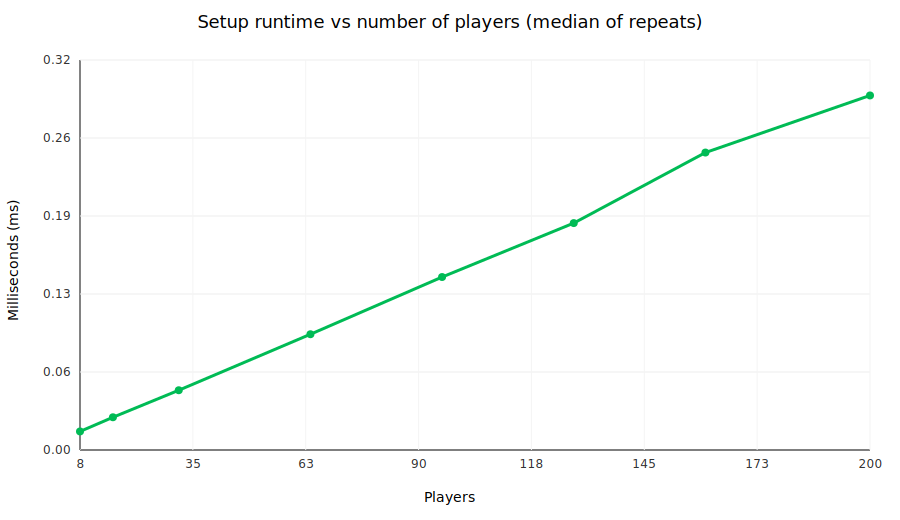
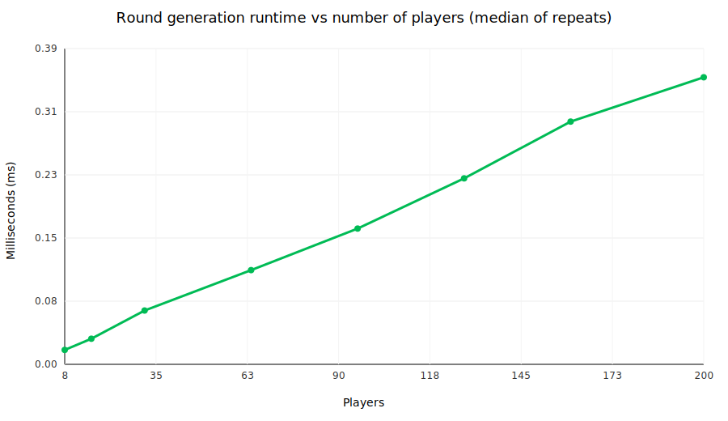
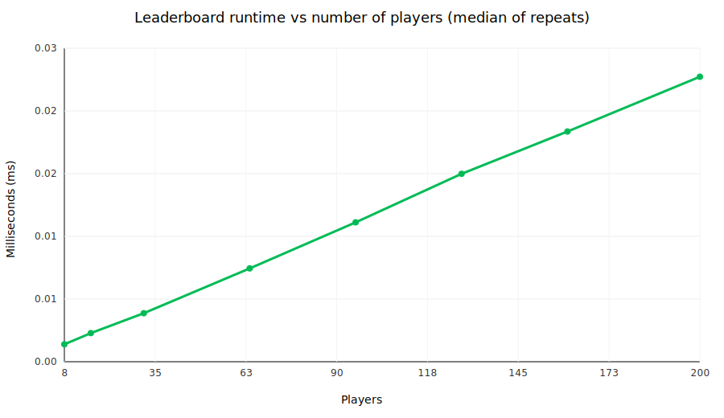

# IS-211 Mandatory Assignment Report (Spring 2026)
## Double-Elimination Table Tennis Tournament Tracker

**Course:** IS-211 (Information Systems Department)  
**Term:** Spring 2026  
**Group members (2–4):** _[Name 1]_, _[Name 2]_, _[Name 3]_, _[Name 4]_  
**Prototype link:** _[paste GitHub repo / deployed link]_  

---

## 1) Business Idea Description

An unofficial table tennis club grew faster than anticipated. With more players joining, the club began organizing tournaments. The chosen tournament format is **double elimination**:

- Every player stays in the tournament until they receive **two losses**.
- After the first loss, a player continues in the **losers bracket**.
- After the second loss, the player is **eliminated**.
- The last remaining player is the winner.

### Problem
Managing a double-elimination tournament becomes difficult as the number of participants grows:

- It’s easy to lose track of who has **0 / 1 / 2 losses**.
- Tracking matches in a spreadsheet is error-prone (wrong match IDs, missing results, inconsistent rules).
- Creating next-round pairings manually is slow and leads to disputes.

### Target users / customers
- Tournament organizers of the club (primary users).
- Players who want transparent standings and confirmation of elimination status (secondary users).

### How software supports the business
The software acts as a lightweight “tournament brain”:

- Stores the current state of players and matches.
- Generates pairings for the next round from **active** (non-eliminated) players.
- Records match results with validation (minimum points + win-by-2 rule).
- Produces leaderboards (eliminated players and active winners list).

This reduces organizer workload, improves fairness/transparency, and makes it feasible to run events regularly as the club continues to grow.

---

## 2) Application Features

This project is a small **FastAPI** backend with a minimal web UI and REST endpoints.

### Core features
- **Tournament setup**: configure number of players and the minimum points required to win a match.  
  - Code: `storage.py:16` (`TournamentState.setup`), `main.py:23` (`/tournament/setup`)
- **Round pairing (groups)**: generate match pairings among currently active players.  
  - Code: `storage.py:26` (`TournamentState.assign_groups`), `main.py:32` (`/tournament/groups`)
- **Report match results**: store results, update wins/losses/scores, and eliminate players at 2 losses.  
  - Code: `storage.py:87` (`TournamentState.report_match`), `main.py:40` (`/tournament/match`)
- **Leaderboards**
  - Eliminated (losers) leaderboard sorted by total score: `storage.py:115`, `main.py:52`
  - Active winners list sorted by wins then score: `main.py:65`
  - Readable text table output: `main.py:73`

### Algorithm (detailed)

The application manages the tournament as **in-memory state** (players + matches) and applies a small set of procedures to progress the tournament round by round.

#### A) Setup / initialization
Code: `storage.py:16`, `main.py:23`

1. Validate input (`player_count` must be even and at least 2).
2. Create `player_count` `Player` objects with IDs `1..player_count`.
3. Reset state: clear stored matches, clear round history, reset counters.
4. Store configuration (`serves_per_match`, `player_count`, optional `service_change_interval`).

#### B) Round generation (pairing)
Code: `storage.py:26`, `main.py:32`

Goal: generate the next set of matches using only **active** players (players who have fewer than 2 losses).

1. Filter active players: `active_players = [p for p in players if not p.eliminated]`.
2. Copy and shuffle the active list (`random.shuffle`) to randomize pairings.
3. Increment the round counter and assign the same `round` number to every match created in that call.
4. Pair players two-by-two in the shuffled list:
   - `(shuffled[0], shuffled[1])`, `(shuffled[2], shuffled[3])`, ...
   - Create a `Match` for each pair and assign a unique `match_id`.
5. Label each match with a simple bracket tag:
   - `"winner"` if both players currently have `0` losses,
   - `"loser"` otherwise (at least one player already has 1 loss).
6. Store the results in two places:
   - `matches[match_id] = match` so results can be reported later by ID,
   - `rounds[round_number] = [match, ...]` as a history of what was scheduled.

Note: this prototype enforces the **two-loss elimination rule** correctly, but the pairing is **random among active players** rather than a full official bracket-tree scheduler.

#### C) Reporting a match (state update + elimination)
Code: `storage.py:87`, `main.py:40`

1. Find the `Match` by `match_id` using the dictionary.
2. Validate the score (must reach at least `serves_per_match` and win by 2 points).
3. Mark the match as finished and store the submitted scores.
4. Determine the winner and loser by comparing the scores.
5. Update player statistics (wins/losses and total_score).
6. If the loser now has `losses >= 2`, mark `eliminated = True`.

#### D) Leaderboards
Code: `storage.py:115`, `main.py:52`, `main.py:65`

- Eliminated leaderboard: filter `eliminated == True` and sort by `total_score`.
- Active winners list: filter `eliminated == False` and sort by wins (descending), then score (descending).

### Data model (classes)
- `Player`: participant stats (`wins`, `losses`, `total_score`, `eliminated`).  
  - Code: `models.py:5`
- `Match`: a pairing of two players with scores and metadata (`round`, `bracket`, `finished`).  
  - Code: `models.py:16`
- `TournamentConfig`: tournament settings (`serves_per_match`, `player_count`, `service_change_interval`).  
  - Code: `models.py:28`

### Notes about “double elimination” in this prototype
This prototype correctly enforces the **two-loss elimination rule** and keeps track of winner/loser status. It labels matches as `"winner"` vs `"loser"` bracket based on whether players already have a loss. Pairings are currently **random among active players**; a full bracket-accurate scheduler can be added as a future improvement.

---

## 3) Analyze the Python Code (Time Complexity)

The code intentionally contains multiple time-complexity types.

### `O(1)` average time (hash-table lookup)
- **Reporting a match by ID** uses dictionary lookup:  
  - Code: `storage.py:88` → `self.matches.get(match_id)`  
  - Why: `self.matches` is a `dict` mapping `match_id → Match`, so lookup is constant-time on average.

### `O(n)` time (linear passes over players)
Let `p` be the number of players.

- **Create players during setup**:  
  - Code: `storage.py:20` → list comprehension creates `p` `Player` objects.
- **Filter active players** when generating the next round:  
  - Code: `storage.py:30` → `[p for p in self.players if not p.eliminated]`
- **Shuffle and pair active players**:  
  - Code: `storage.py:58` (`random.shuffle`) and `storage.py:66` (pairing loop in steps of 2)  
  - Why: both operations process the list of active players once.

### `O(k log k)` time (sorting for leaderboards)
Let `k` be the number of eliminated players (`k ≤ p`).

- **Eliminated leaderboard** sorts eliminated players by `total_score`:  
  - Code: `storage.py:118` → `sorted(eliminated, key=...)`  
  - Why: Python’s sorting is `O(k log k)` in the typical comparison model.
- **Active winners list** sorts active players by wins then score:  
  - Code: `main.py:70` → `sorted(active, key=...)`  
  - Complexity: `O(a log a)` where `a` is the number of active players.

### Empirical tests and graphs (measured scaling)

Besides the theoretical analysis above, the repository includes:

- Automated correctness tests:
  - `test_tournament.py` (API-level smoke test using FastAPI's `TestClient`)
  - `test_state_unit.py` (unit tests for state setup, pairing, and elimination)
- A small benchmark script that measures runtime as the number of players grows and generates graphs:
  - Run: `python scripts/benchmark_complexity.py`
  - Outputs: `report_assets/benchmark_results.csv`, plus three SVG charts:
    - `report_assets/complexity_setup.svg`
    - `report_assets/complexity_assign_groups.svg`
    - `report_assets/complexity_leaderboard.svg`

These measurements are machine-dependent, but the *trend* should match the expected growth rates (roughly linear for setup/pairing and super-linear for sorting in the leaderboard).

<figure>
  
  <figcaption><strong>Figure 1.</strong> Setup runtime as the number of players grows.</figcaption>
</figure>

<figure>
  
  <figcaption><strong>Figure 2.</strong> Round generation (shuffle + pairing) runtime as the number of players grows.</figcaption>
</figure>

<figure>
  
  <figcaption><strong>Figure 3.</strong> Leaderboard runtime (filter + sort eliminated players) as the number of players grows.</figcaption>
</figure>

If your Markdown viewer does not render SVG images, open the files directly from `report_assets/`.

---

## 4) Data Structures

The solution uses multiple course-level data structures.

### List / array (`list`)
- `self.players: List[Player]` stores all players.  
  - Code: `storage.py:9`
- How/why it’s used:
  - Easy to iterate and filter (active vs eliminated).
  - Suitable for shuffling and pairing players into matches.

### Hash table (`dict`)
- `self.matches: Dict[int, Match]` maps match IDs to `Match` objects.  
  - Code: `storage.py:10`
- How/why it’s used:
  - Enables fast (`O(1)` average) access when a match result is reported by `match_id`.

### Dictionary-of-lists (schedule history)
- `self.rounds: Dict[int, List[Match]]` maps `round_number → matches_in_round`.  
  - Code: `storage.py:12`
- How/why it’s used:
  - Stores a simple schedule/history of generated rounds (useful for displaying or auditing pairings later).

---

## Appendix A — How to Run (Prototype)

See `README.md` for local setup and running the server.

---

## Appendix B — AI Tools Used (if any)

AI tools were used during development (not for report writing).

- Tool(s): _[name the tool(s) you used, e.g., ChatGPT / Cursor / Copilot]_
- What it was used for:
  - Generating project documentation (`README.md`, `DOCUMENTATION.md`).
  - Generating the tournament simulation script (`simulate.py`).
- Representative prompts:  
  1. _[paste a prompt you used to generate/improve the README]_  
  2. _[paste a prompt you used to generate the simulation code]_  
  3. _[optional: paste a prompt you used to debug/refine the simulation]_  
